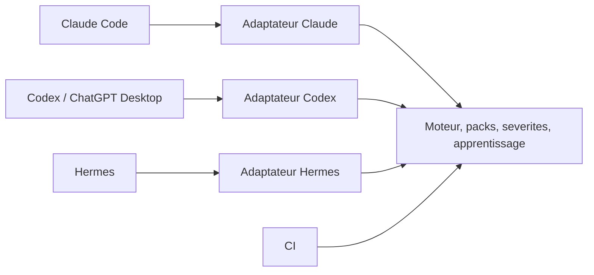

# Audit de compatibilité Codex et Claude Code, 15 septembre 2026

**Verdict : BLOCK pour présenter Craftsman 4.10.3 comme une protection fonctionnelle complète sous Codex.** L'import charge une partie du plugin. Le protocole des écritures et plusieurs workflows restent spécifiques à Claude Code. Certains défauts reproduits affectent aussi Claude Code.

## Périmètre et preuves

Revue du plugin entier par surfaces : hooks, bibliothèques de frontière, moteur, sept packs, CI, adaptateur Hermes, skills, agents, templates, export et publication. Analyse initiale sur `879e432` et sur le cache importé `craftsman/4.10.3`. Le checkout est passé à `fc502c7` pendant l'audit via une autre session : ce changement corrige la version du manifeste Hermes et ne corrige pas les constats de compatibilité ci-dessous. Aucun correctif produit ni activation de hook effectué par cet audit.

Environnement constaté : ChatGPT Desktop `26.908.61612` (build `9218`), binaire embarqué `0.154.0-alpha.6.2`, CLI global `0.154.0`. Les versions ne doivent pas être confondues avec celle du plugin.

Les preuves combinent les deux captures fournies, les contrats officiels actuels, la lecture du code livré, des sondes différentielles sur les scripts réels et les méthodes de lecture `hooks/list` et `skills/list` du CLI Codex 0.154.0. Le catalogue reçu dans cette session Desktop confirme aussi les 19 skills visibles. Il n'y a pas eu de session modèle de bout en bout effectuant une écriture avec les hooks corrigés.

## Réponse à « Hook N, sans nom, est-ce normal ? »

**Oui, dans cette version de l'application.** Le composant livré `webview/assets/hooks-settings-abd54134dbb1.js`, extrait en lecture seule de `app.asar`, appelle directement le formateur du numéro pour le titre de chaque ligne. Le module `hooks-settings-copy-3e338c0ace44.js` formate `Hook {index}`. Il ne choisit pas le nom du script ni `statusMessage` pour ce titre.

`statusMessage` est affiché dans les détails et sert de message d'exécution. Ajouter ce champ améliorerait l'identification, mais ne renommerait pas ces lignes dans le composant observé. Ajouter un champ arbitraire `name` ne constitue pas une correction démontrée.

Les captures du 14 septembre montrent des hooks à approuver. La lecture actuelle du CLI Codex donne **14 handlers Craftsman activés et approuvés**, sans erreur ni avertissement. L'état a donc évolué depuis les captures. Cet audit n'a ni accordé la confiance ni activé les hooks. L'import et la confiance sont distincts, conformément au [contrat de confiance des hooks](https://learn.chatgpt.com/docs/hooks#review-and-trust-hooks).

Correspondance des lignes visibles, dans l'ordre du manifeste importé :

| Événement | Hook 1 | Hook 2 | Hook 3 |
|---|---|---|---|
| PreToolUse | Protection des configurations | Validation avant écriture | Vérification avant push |
| PostToolUse | Validation et apprentissage après écriture | Revue DDD sémantique | Résultat des tests |
| PreCompact | Sauvegarde de l'état | | |
| PostCompact | Restauration et vérification | | |
| SessionStart | Initialisation et contexte | | |
| SessionEnd | Métriques et nettoyage | | |
| UserPromptSubmit | Détection des biais | | |
| SubagentStop | Contrôle du sous-agent | | |
| Stop | Contexte Sentry | Revue finale sémantique | |

## BLOCKING

### C1. P1 : les patches Codex passent sans contrôle

**Localisations :** `hooks/pre-write-check.sh:36`, `hooks/config-protection.sh:23`, `hooks/post-write-check.sh:203`, `hooks/lib/write_mirror.py:196`.

Ces lecteurs attendent `tool_input.file_path` et quittent sans verdict s'il manque. Une même classe PHP non finale important Infrastructure depuis Domain produit `PHP002` et `LAYER001`, sortie 2, via `Write`. Sous la forme `apply_patch`, elle produit une sortie 0 silencieuse avant et après écriture. Même différence pour une configuration `phpstan.neon` protégée.

Le matcher fonctionne : Codex reconnaît les aliases `Write|Edit`, mais transmet le patch dans `tool_input.command`. Les aliases `CLAUDE_PLUGIN_ROOT/DATA` existent également. Le problème est le lecteur du contenu, pas ces noms. [Contrat des outils et aliases](https://learn.chatgpt.com/docs/hooks#tool-coverage).

**Correction :** adapter l'entrée en une liste de fichiers et contenus futurs, gérer ajout, modification, suppression, déplacement et patch multifichier, puis appeler le miroir et les validateurs existants. Adapter aussi `updatedInput` et la décision de protection : `hooks/config-protection.sh:70` émet `ask`, qui n'offre pas la même garantie sous Codex. Ne pas simplement remplacer `Write` par `apply_patch`.

**Sortie attendue :** contrôle valide appliqué et contrôle invalide refusé avant disque par les deux hôtes, y compris patch multifichier et modification de configuration. L'apprentissage doit ensuite observer réellement ces écritures.

### C2. P1, deux hôtes : un test réussi devient une fausse régression

**Localisation :** `hooks/post-bash-test-verify.sh:21`.

Le script lit `tool_result`, alors que les événements documentés utilisent `tool_response`. Son fallback invente un code d'échec 1. Sonde avec `verified=true` puis un résultat réussi dans `tool_response` : message `REGRESSED`, sortie 2, `verified=false`. Le témoin historique utilisant `tool_result` reste vert. Les fixtures existantes valident ce mauvais contrat. [Référence PostToolUse Claude Code](https://code.claude.com/docs/en/hooks#posttooluse).

**Correction :** interpréter la réponse propre à chaque hôte, attendre la fin des commandes asynchrones et traiter un résultat absent comme inconnu. Conserver stdout pour le protocole JSON. **Sortie attendue :** succès réel enregistré, échec réel révoquant la preuve, absence de résultat sans fausse régression.

### C3. P1 conditionnel : séparation des sessions perdue sans alias Claude

**Localisations :** `hooks/lib/session-files.sh:29`, `hooks/session-start.sh:44`, `hooks/session-metrics.sh:27`, `hooks/session-start.sh:60`.

Le nom du fichier dépend de `CLAUDE_CODE_SESSION_ID`, sans utiliser le `session_id` de l'entrée. Deux événements A/B avec IDs distincts et sans cet alias alimentent le même `session-state.json`. Une fin de session peut donc nettoyer cet état commun. Les wrappers et ponts globaux écrits sous `~/.claude` ajoutent un risque de mélange entre installations.

L'alias est absent des processus `exec_command` de cette session. **L'environnement d'un hook réellement déclenché n'a pas été capturé : une collision en production n'est pas affirmée.** Le défaut reproduit suffit à exiger une preuve avant de promettre l'isolation.

**Correction :** identité stdin canonique dans les hooks, contexte explicite pour les skills, résolution par hôte et session, suppression du fallback partagé lorsqu'un ID est connu. **Sortie attendue :** sessions Codex A/B et Claude simultanées, trois états distincts, fin de B préservant A.

### C4. P1 : l'export de doctrine détruit un AGENTS.md existant

**Localisations :** `ci/doctrine-export.sh:127`, `skills/ci/SKILL.md:90`.

Le vrai CLI `export --target agents-md`, exécuté sur une fixture avec une instruction témoin, retourne 0 et remplace le fichier entier. Le témoin disparaît. C'est particulièrement dommageable après un import qui vient de créer les instructions projet.

**Correction :** gérer seulement un bloc Craftsman délimité, ou refuser le remplacement d'un fichier non possédé par le générateur. **Sortie attendue :** deux exports successifs préservent l'instruction extérieure et ne dupliquent pas la doctrine.

### C5. P1 : des skills livrées et des apprentissages approuvés ne sont pas découverts

**Localisations :** `skills/agent-design/SKILL.md:1`, `skills/mlops/SKILL.md:1`, `skills/rag/SKILL.md:1` (liens vers les commandes du pack AI/ML).

`skills/list` retourne 19 skills Craftsman, sans erreur. La sonde comparative du chargeur montre : fichier régulier visible, fichier `SKILL.md` en lien symbolique absent, remplacement par les mêmes octets visible, remise du lien absent. Un dossier de skill en lien symbolique est, lui, accepté. Cette distinction importe : la documentation autorise les dossiers liés. [Découverte des skills](https://learn.chatgpt.com/docs/build-skills).

Le même défaut de destination affecte la boucle d'apprentissage : `hooks/lib/instincts.py:280` accepte `.claude/skills` et refuse `.agents/skills`. `skills/metrics/SKILL.md:278` et `skills/setup/SKILL.md:37` y dirigent les fichiers générés. Le témoin `.claude/skills` n'est pas découvert par Codex, contrairement au témoin `.agents/skills`. Une approbation peut donc produire un fichier que Codex ne chargera jamais.

**Correction :** livrer des points d'entrée réguliers ou des dossiers liés testés, et résoudre les destinations de conventions et d'apprentissages par hôte sans relâcher les contrôles de provenance. **Sortie attendue :** 22 skills livrées visibles et apprentissage nouvellement approuvé découvert par le bon consommateur; mêmes témoins négatifs conservés.

## MUST FIX

### C6. P2 : les agents et l'orchestration ne sont pas portés

**Localisations :** `skills/team/SKILL.md:15`, `skills/team/SKILL.md:42`, `agents/architect.md:1`.

Les 12 profils Markdown importés conservent leurs conventions Claude. Aucun profil Craftsman n'est disponible dans la liste des types d'agents de cette session. `team` choisit sa stratégie sur un flag Claude et utilise les tâches et chemins de cette application. Le flag copié dans `.codex/config.toml` ne démontre pas ces capacités.

**Correction :** conserver les instructions métier, adapter les profils et opérations aux outils réellement disponibles. Les profils Codex documentés utilisent des fichiers TOML et des champs propres à l'hôte. Choisir les modèles dans son catalogue, sans transposer aveuglément les alias Claude. [Configuration des sous-agents](https://learn.chatgpt.com/docs/agent-configuration/subagents).

**Sortie attendue :** profils découverts, spécialiste invoqué avec ses instructions, résultat rendu au parent, fallback explicite lorsqu'une capacité manque.

### C7. P2 : le contexte dynamique des skills reste du texte

**Localisations :** `skills/challenge/SKILL.md:30`, `skills/challenge/SKILL.md:95`, `hooks/session-start.sh:60`.

Les expressions `!` suivies d'une commande entre backticks sont restées littérales dans le skill reçu par cette session. Pourtant le texte suppose ensuite que codemap, diff et historique sont déjà injectés. Les chemins des helpers restent sous `~/.claude`.

**Correction :** collecte explicite, portable et bornée au début du workflow, avec état « indisponible » lorsque la source manque. Résoudre les helpers dans l'installation active. **Sortie attendue :** une revue reçoit effectivement diff, carte et historique, ou mentionne chaque absence.

### C8. P2 : le backend sémantique et sa livraison restent Claude

**Localisations :** `hooks/lib/haiku-verify.sh:31`, `hooks/lib/haiku-verify.sh:57`, `hooks/hooks.json:153`, `hooks/agent-final-review.sh:126`.

La vérification lance exclusivement `claude -p`; sans ce CLI, elle disparaît silencieusement. Le réveil repose sur une sortie 2 en arrière-plan. Codex documente une livraison différée des informations, sans nouveau tour automatique lorsque la session est inactive. [Sémantique des hooks de fond](https://learn.chatgpt.com/docs/hooks#run-hooks-in-the-background).

**Correction :** backend explicitement choisi, disponibilité visible, verdict commun et livraison adaptée à l'hôte. Si la continuation est obligatoire, utiliser un contrôle synchrone borné et testé. **Sortie attendue :** fonctionnement déclaré et vérifié sur une machine Codex seule, puis réception effective d'un finding par la bonne session.

### C9. P2, deux hôtes : le contrôle de sous-agent examine le parent

**Localisations :** `hooks/subagent-quality-gate.sh:34`, `hooks/subagent-quality-gate.sh:63`, `tests/core/test-agent-hooks.sh:217`.

Le lecteur prend `transcript_path` au lieu de `agent_transcript_path`. Parent vide et enfant ayant écrit du code invalide : silence. En substituant le transcript enfant dans le champ parent : findings. Le parser des fichiers touchés dépend aussi des blocs JSONL Claude.

**Correction :** bon transcript côté Claude, journal des fichiers par sous-agent depuis les événements normalisés côté Codex. **Sortie attendue :** fichiers et findings de l'enfant correctement attribués, parent exclu.

### C10. P2 : trois événements du manifeste ne sont pas chargés

**Localisations :** `hooks/hooks.json:68`, `hooks/hooks.json:78`, `hooks/hooks.json:98`.

Le manifeste contient 17 handlers. `hooks/list` en charge 14 : `TaskCompleted`, `PostToolUseFailure` et `FileChanged` sont absents, sans avertissement dans l'inventaire filtré Craftsman. Le schéma produit par le binaire embarqué les exclut aussi de son enum. Ce constat est borné au consommateur testé.

**Correction :** définir un inventaire par hôte et réaffecter les fonctions aux événements disponibles. Ajouter un contrôle attendu/chargé : une déclaration ignorée ne doit pas compter comme une fonction active. **Sortie attendue :** chaque fonction annoncée a un déclenchement mesuré, ou un statut d'indisponibilité explicite.

### C11. P2, deux hôtes : le hook Sentry sur Stop est inatteignable

**Localisations :** `hooks/hooks.json:146`, `hooks/agent-sentry-context.sh:25`.

Le script exige le chemin d'un fichier dans `tool_input`, absent du contrat Stop. Il quitte avant la demande Sentry. **Correction :** exploiter les fichiers accumulés dans la session ou un événement d'écriture normalisé, puis émettre le contexte sur le canal réellement reçu par le modèle. **Sortie attendue :** fixture Stop réaliste atteignant le chemin prévu, sans compte Sentry requis pour le test.

### C12. P2 : la CI ne prouve pas le livrable Codex

**Localisations :** `tests/adapters/test-parity.sh:75`, `tests/adapters/test-parity.sh:98`, `tests/run-tests.sh:308`, `scripts/release-build.sh:47`.

La parité injecte directement des objets de type Claude dans les scripts. L'archive ne contient pas les fichiers Codex non suivis créés par cet import. Le chargement réussi du cache montre qu'il ne faut pas déclarer le manifeste Claude universellement incompatible ; il faut rendre l'installation Codex reproductible et la tester.

**Correction :** ajouter des fixtures des protocoles des deux hôtes et des tests réels de découverte et d'exécution des paquets distribués. Générer les différences nécessaires à partir d'une source commune. **Sortie attendue :** installation fraîche, inventaire attendu, contrôle valide, contrôle invalide et isolation des sessions vérifiés pour chaque version ciblée.

## IMPROVE

`hooks/hooks.json:9` et les autres handlers n'ont pas de `statusMessage`. En ajouter de courts et distincts aiderait à comprendre les détails et l'exécution. **P3**, après les défauts fonctionnels. L'affichage des titres « Hook N » reste une évolution de l'application, pas un défaut de nommage démontré du manifeste.

## Ce qu'il faut conserver

Le vrai CLI du coeur fonctionne sans session Claude : un TypeScript valide passe, le même fichier avec `any` échoue avec `TS001`. Packs, règles, sévérités par répertoire, précédence et miroir constituent donc une base réutilisable. Les requêtes SQLite paramétrées, états atomiques, garde de récursion, tests de témoins négatifs et archive reproductible sont utiles.

L'architecture recommandée prolonge `docs/adr/0029-host-adapter-contract.md` : adaptateurs aux frontières, moteur commun. Le renommage global de « Claude » en « Codex » dans les instructions importées ne réalise pas cette adaptation.

## Vérifications et limites

| Vérification | Résultat |
|---|---|
| Chargeur Codex, hooks | 14/17 handlers présents, 14 approuvés et actifs |
| Chargeur Codex, skills | 19/22 attendues, sonde des liens vue rouge et verte |
| Tests hooks / agent hooks / état | 141 + 43 + 21 assertions réussies |
| Recontrôle métriques / démarrage / legacy | 28 + 12 + 20 assertions réussies |
| CLI moteur | TypeScript valide : 0 ; `any` : 2 et TS001 |
| Sondes des formats d'entrée | Défauts C1, C2, C3 et C9 reproduits |
| Export AGENTS.md | Perte du témoin reproduite |

La première suite complète a donné 263 contrôles réussis et 4 sous-suites en échec. La garde globale choisie pour interdire les appels modèles désactivait aussi les hooks de session. Les quatre sous-suites ont ensuite été vérifiées sans cette garde, en environnement isolé, et passent. Il n'y a pas eu de nouvelle exécution complète sans instrumentation ; aucun « tout vert de bout en bout » n'est revendiqué.

La consultation de l'historique local sur sept jours retourne des violations côté Claude et aucune côté Codex ; elle ne prouve ni leur exhaustivité ni l'activité des gates Codex. `gbrain query --no-expand` a échoué sur un verrou PGLite : le backlog et l'ADR ont été consultés directement. Le graphe `graphify-out/graph.json` était absent, donc aucune preuve ne lui est attribuée.

**Non vérifié de bout en bout :** écriture déclenchée par un modèle réel dans chaque application, environnement exact des processus hooks Codex, facturation et livraison des vérificateurs sémantiques, services Sentry, analyseurs externes installés, quatre fournisseurs CI distants, Windows. L'audit couvre les surfaces du plugin ; il ne certifie pas chaque combinaison opérationnelle.

## Ordre proposé

1. C1, C2, C3 : restaurer le contrôle d'écriture et la fiabilité de ses preuves, avec tests de contrat dès cette étape.
2. C4 : protéger les instructions existantes avant tout export ou onboarding.
3. C5, C6, C7 : livrer skills et agents réellement utilisables.
4. C8 à C11 : aligner les fonctions secondaires et leur livraison.
5. C12 : valider une installation fraîche et la publication des deux variantes, puis améliorer les messages.

**Bilan : 5 constats bloquants, dont 1 conditionnel à vérifier en processus hook ; 7 corrections nécessaires ; 1 amélioration. Verdict : BLOCK.**

## Dossier de preuves

Les [rapports détaillés des hooks](audit-codex-claude-2026-09-15-evidence/hooks.md), [workflows](audit-codex-claude-2026-09-15-evidence/skills.md) et [coeur/CI](audit-codex-claude-2026-09-15-evidence/core.md) conservent les analyses spécialisées. Le dossier adjacent contient les sondes JSON, l'inventaire du chargeur, les contrôles des liens, les logs de tests et la provenance du composant UI. Le présent rapport fait autorité pour la synthèse et le dédoublonnage des sévérités.
