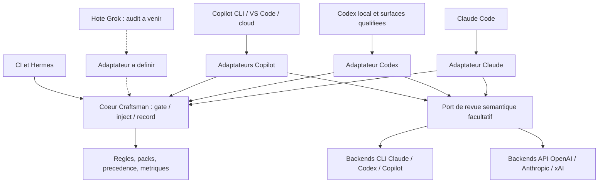

# Craftsman : recherche d'interopérabilité des hôtes et moteurs IA

Recherche et vérification documentaire du **15 septembre 2026**. État produit : Craftsman 4.10.3, audit initial `879e432`, checkout actuel `fc502c7`. Ce document propose une architecture et une campagne de qualification. Il ne constitue ni une implémentation ni une certification des hôtes.

**Recommandation : conserver le moteur déterministe, extraire ses dépendances d'hôte et fournir des adaptateurs explicites.** Partager les procédures et les règles ; traduire les protocoles, permissions, événements, installations et réponses des modèles aux frontières. La compatibilité complète du coeur est un objectif vérifiable. L'identité de toutes les fonctions sur toutes les interfaces ne doit pas être promise.

## 1. Ce que les sources établissent

Trois catégories restent séparées dans ce rapport : **D**, contrat documenté officiellement ; **O**, observation du consommateur ou du code local ; **P**, proposition de conception fondée sur ces preuves. Une absence dans une documentation n'est pas une interdiction. Les versions installées priment pour déclarer une fonction opérationnelle.

Les preuves locales réutilisées sont dans l'[audit CR-117](audit-codex-claude-2026-09-15.md) et son [dossier de sondes](audit-codex-claude-2026-09-15-evidence/). Elles concernent Desktop `26.908.61612`, CLI embarqué `0.154.0-alpha.6.2`, CLI global `0.154.0`. Le chargeur observé trouvait 14/17 hooks et 19/22 skills. Aucun test réel Copilot ni appel de vérificateur IA n'a été exécuté pour cette recherche. L'aide locale `codex exec --help` confirme les options de sortie structurée citées ci-dessous.

### Les distinctions qui changent la solution

| Sujet | Fait vérifié et conséquence |
|---|---|
| Import depuis Claude Code | **D :** OpenAI documente l'import des hooks, plugins et sous-agents, avec revue des permissions, interpolations et différences de comportement. **P :** conserver ce parcours, mais qualifier son résultat. L'import n'est pas une preuve de parité. [Import officiel][O2] |
| Format commun | **D :** Agent Plugins 1.0 standardise skills et MCP, avec extensions par client. **P :** l'utiliser pour la distribution commune, sans lui attribuer une normalisation des hooks. [Standard][S1] |
| Hôte et modèle | **O :** le vérificateur appelle directement `claude -p` dans [haiku-verify.sh](../../hooks/lib/haiku-verify.sh). **D :** Codex, Claude et Copilot ont des interfaces non interactives distinctes. **P :** deux familles d'adaptateurs indépendantes. [Codex][O7], [Claude][A3], [Copilot][G8] |
| ChatGPT et Codex | **D :** des plugins sont disponibles sur plusieurs surfaces ; l'extension IDE Codex ne prend pas en charge les plugins selon la documentation actuelle. Skills autonomes et MCP y sont documentés. **P :** prévoir un déploiement projet complémentaire. [Plugins][O9], [skills][O4], [MCP][O8] |
| Grok | **D :** xAI expose génération et réponses structurées, avec exemples utilisant le SDK OpenAI. **P :** un backend de revue Grok est envisageable. Cela ne démontre aucun protocole de hooks pour une application Grok. Cet audit d'hôte reste réservé à Alexandre. [Génération][X1], [sorties structurées][X2] |

La recherche utilise les décisions locales de l'[ADR-0029](../adr/0029-host-adapter-contract.md). La consultation Brain précédente a échoué sur un verrou PGLite ; le backlog a été lu directement. Aucun précédent architectural supplémentaire n'est inventé.

## 2. Matrice des surfaces à qualifier

Les lignes indiquent des contrats publiés, pas des badges de compatibilité Craftsman acquis.

| Surface | Entrée à préparer | Point de vigilance | Sources |
|---|---|---|---|
| Claude Code local | Plugin Claude, skills et agents natifs | Préserver le fonctionnement existant et corriger aussi les défauts communs C2/C9 | [Plugins][A4], [agents][A5] |
| Codex dans ChatGPT Desktop | Plugin installé, adaptateur Codex | Vérifier le binaire embarqué, la confiance et l'exécution des hooks | [Plugins][O9], [tests de plugin][O10] |
| Codex CLI | Même coeur, distribution Codex | Qualifier séparément la version CLI et le mode non interactif | [Packaging][O3], [CLI][O7] |
| Extension IDE Codex | Skills projet, instructions et MCP configurés | Plugin non pris en charge dans cette surface ; recette de déploiement projet nécessaire | [Plugins][O9], [skills][O4], [MCP][O8] |
| ChatGPT web/mobile et Work hébergé | Skills et outils distants adaptés | Installer un plugin web ne déploie pas les scripts locaux ; Work et discussion ordinaire ne prouvent pas la même capacité d'exécution | [Surfaces et scripts][O9], [MCP hébergé][O8] |
| Copilot CLI | Plugin ou configuration de dépôt | Contrat CLI propre, même si un format Claude est accepté | [Plugin CLI][G2] |
| Copilot dans VS Code | Configuration du workspace et profils | Hooks Preview ; adaptation des outils requise | [Hooks VS Code][V1], [profils][V3] |
| Copilot cloud agent | Fichiers du dépôt, environnement distant | Qualifier installation, dépendances et conservation des preuves séparément | [Personnalisation cloud][G10] |
| Hôte Grok | À déterminer dans l'audit séparé | Aucun support des hooks, plugins ou sous-agents déduit de l'API xAI | [API xAI][X1] |
| CI et Hermes existants | Façades actuelles | Les conserver dans les tests de parité pendant l'extraction | [Contrat du projet](../adr/0029-host-adapter-contract.md) |

## 3. Contrats de hooks : différences fact-checkées

Ce tableau concentre les faits protocolaires ; les sections suivantes décrivent nos choix d'adaptation.

| Contrat | Faits documentés |
|---|---|
| Codex | `Write/Edit` reconnaît `apply_patch`, dont le patch arrive dans `tool_input.command`. `tool_response` dépend de l'outil ; `write_stdin` peut livrer une fin de commande. `session_id` vient de stdin ; les hooks de sous-agent utilisent l'ID parent. Le transcript est instable. `ask` en PreToolUse est actuellement non pris en charge : erreur puis poursuite. PostToolUse ne défait pas l'écriture. Un Stop synchrone peut demander une continuation ; un hook de fond ne réveille pas une session inactive. Certains outils échappent aux hooks. [Référence Codex][O1] |
| Claude Code | `tool_response` dépend aussi de l'outil ; son nom ne garantit pas un `exit_code`. `PostToolUseFailure` complète les échecs, `FileChanged` observe des changements hors Write/Edit. `SubagentStop` expose `agent_transcript_path`. `asyncRewake` peut réveiller Claude sur sortie 2. [Référence Claude][A1] |
| Copilot CLI et cloud | camelCase et PascalCase produisent des enveloppes différentes. `preToolUse` peut refuser ; `ask` devient refus dans le cloud. Une commande pré-hook en erreur refuse l'outil, mais un timeout laisse poursuivre. Le cloud est Linux, éphémère et non interactif ; il charge `.github/hooks/*.json`. [Référence GitHub][G1] |
| Copilot VS Code | Le format Claude est reconnu, mais les valeurs de `matcher` sont actuellement ignorées. Les outils gardent leurs noms et arguments VS Code, par exemple `create_file` et `filePath`. Les huit événements documentés n'incluent pas SessionEnd. [Guide VS Code][V1] |

**P :** une décision du moteur et son effet dans l'hôte sont deux résultats à mesurer. Un retour JSON correct ne suffit pas : la recette doit observer le fichier, la continuation, la réception du finding et les erreurs. Un contrôle obligatoire dispose d'un délai interne inférieur à celui de l'hôte, d'un refus explicite en cas d'échec maîtrisé et d'une vérification CI indépendante. Cela réduit les silences ; cela ne transforme pas les hooks en confinement absolu. Sources : contrats ci-dessus et [ADR-0029](../adr/0029-host-adapter-contract.md).

## 4. Adaptations prioritaires, reliées aux constats existants

Chaque proposition indique une preuve d'entrée, un changement concret et sa métrique de sortie. Les CR ci-dessous sont déjà inscrits au backlog ; cette recherche ne les duplique pas.

### R1. Normaliser les écritures avant le moteur, CR-118 / C1

**O :** les lecteurs de [pre-write-check.sh](../../hooks/pre-write-check.sh), [config-protection.sh](../../hooks/config-protection.sh) et [post-write-check.sh](../../hooks/post-write-check.sh) attendent un chemin unique. Les sondes ont reproduit un refus via Write et un passage silencieux via apply_patch. [Preuves C1](audit-codex-claude-2026-09-15.md#c1-p1--les-patches-codex-passent-sans-contrôle), [contrat cible][O1].

**P :** produire une liste de changements avec opération, ancien/nouveau chemin, contenu proposé et empreinte du contenu de départ. Couvrir ajout, édition, suppression, déplacement et plusieurs fichiers. Évaluer l'ensemble avant toute écriture, avec les règles de confiance antérieures au patch : un patch ne doit pas assouplir sa propre politique. Réutiliser le miroir existant. Pour la première livraison, refuser avec diagnostic un cas non normalisable ; ajouter la réécriture automatique seulement quand le round-trip du patch est prouvé.

**Recette :** patch mixte valide/invalide entièrement refusé, configuration protégée, fichier déplacé, fin de ligne et Unicode préservés, exécution depuis un sous-dossier. Contrôle positif puis réintroduction du parseur fautif : test rouge au vrai consommateur. L'écriture par shell arbitraire demeure une couverture distincte, à contrôler après exécution et en CI.

La traduction d'un refus utilise la décision réellement bloquante de l'événement cible. Un `pass` signifie seulement « conforme aux règles Craftsman » : l'adaptateur conserve les permissions et approbations natives, sans transformer ce verdict en autorisation supplémentaire. C'est une règle de conception à éprouver avec un outil conforme qui nécessite encore une approbation de l'hôte. [Décisions Codex][O1], [décisions Copilot][G1].

### R2. Fiabiliser la preuve de tests, CR-119 / C2

**O :** [post-bash-test-verify.sh](../../hooks/post-bash-test-verify.sh) invente un échec quand `tool_result` manque. **D :** les contrats réels sont spécifiques aux outils. [Audit C2](audit-codex-claude-2026-09-15.md), [Claude][A1], [Codex][O1], [Copilot][G1].

**P :** ne pas se limiter au renommage vers `tool_response.exit_code`. Capturer les réponses réelles de succès, échec, interruption et exécution encore active ; écrire un décodeur par outil/version. L'état interne de commande devient `running`, `succeeded`, `failed`, `interrupted` ou `unknown`. Une sortie inconnue n'accorde aucune preuve et n'invente aucune régression. Une preuve est attachée au périmètre et à l'empreinte testés ; une nouvelle modification la rend périmée.

**Recette :** vrai test passant, vrai test échouant, commande longue terminée par polling, résultat absent et annulation. Aucune assertion positive fondée uniquement sur la phrase du modèle « tests passed ».

### R3. Identité et stockage indépendants de Claude, CR-120 / C3

**O :** [session-files.sh](../../hooks/lib/session-files.sh) et les wrappers de [session-start.sh](../../hooks/session-start.sh) dépendent de chemins ou d'aliases Claude. Collision reproduite sans alias ; environnement exact du hook Codex encore à capturer. [Sondes](audit-codex-claude-2026-09-15-evidence/hook-session-probes.json), [identité Codex][O1].

**P :** passer un contexte explicite `host`, `workspace`, `session`, `agent`, `turn`, `invocation`. Les identifiants absents restent absents : jamais de session globale partagée pour simuler une identité. Le contexte des helpers exécutés par un skill doit être transmis explicitement, car ils ne reçoivent pas forcément stdin de hook.

Séparer ressources immuables, cache d'adaptateur et données Craftsman. Garder SQLite comme registre unique logique ; offrir un emplacement partagé configuré pour les hôtes locaux qui doivent partager les apprentissages. Ne pas fusionner automatiquement les bases existantes. Préserver requêtes paramétrées, écritures atomiques et attribution au projet. [Contrat record/inject](../adr/0029-host-adapter-contract.md), [chemins de plugin OpenAI][O3].

**Recette :** deux sessions Codex et une Claude simultanées, enfant distinct du parent, fin de B préservant A, reprise après interruption, aucune écriture dans le cache immuable.

### R4. Préserver la doctrine de l'utilisateur, CR-121 / C4

**O :** le vrai [exporteur](../../ci/doctrine-export.sh) remplace AGENTS.md. **D :** Codex compose des instructions hiérarchiques avec limite de taille ; Copilot possède plusieurs formats et portées. [Instructions Codex][O6], [matrice Copilot][G5].

**P :** générer un bloc Craftsman délimité, idempotent, avec provenance et version. Respecter intégralement les zones extérieures. Garder les sévérités dans le moteur ; les instructions n'en sont qu'un résumé. Adapter la projection vers CLAUDE.md, AGENTS.md ou les instructions Copilot selon le déploiement.

**Recette :** deux exports conservent l'instruction témoin, aucune duplication, chargement réel depuis racine et sous-répertoire, limite de contexte respectée.

### R5. Skills portables et apprentissages réellement visibles, CR-122 / C5

**O :** trois SKILL.md liés ne sont pas découverts, contrairement aux mêmes octets matérialisés. **D :** Codex documente les dossiers de skills liés, `.agents/skills` et la politique `allow_implicit_invocation` dans `agents/openai.yaml`. [Skills Codex][O4], [sondes de découverte](audit-codex-claude-2026-09-15-evidence/skills-consumer-5.json).

**P :** matérialiser les points d'entrée au packaging, avec contrôle de non-divergence depuis la source. Garder le frontmatter commun du standard, placer les extensions dans les projections d'hôtes. Traduire la politique d'invocation plutôt que recopier `disable-model-invocation`. N'interpréter ni `effort`, ni `model`, ni `allowed-tools` comme des garanties universelles. Le standard qualifie d'ailleurs `allowed-tools` d'expérimental. [Agent Skills][S2], [extensions Claude][A2].

L'approbation d'un apprentissage reste enregistrée dans la base puis projetée vers la destination de l'hôte. Conserver les contrôles de provenance de [instincts.py](../../hooks/lib/instincts.py) en les généralisant, pas en les supprimant. **Recette :** 22 entrées attendues découvertes, skill explicite accessible, skill réservée à l'utilisateur non déclenchée implicitement, apprentissage approuvé réellement disponible. [ADR-0029](../adr/0029-host-adapter-contract.md).

### R6. Agents et orchestration, CR-123 / C6

**O :** les profils Craftsman importés ne sont pas proposés comme rôles dans la session auditée. Cela ne contredit pas l'import de sous-agents documenté par OpenAI. **D :** Codex définit des agents TOML avec `name`, `description`, `developer_instructions`. Claude et Copilot exposent leurs propres profils et règles d'outils. [Codex][O5], [Claude][A5], [Copilot][G3], [import][O2].

**P :** conserver la mission du reviewer, les références métier et le contrat de livraison en commun. Générer les permissions, modèles et métadonnées d'hôte. La stratégie choisit entre délégation autorisée et travail séquentiel selon les outils réellement exposés ; elle ne dépend plus du flag teams Claude. Le nom du modèle et son effort sont configurés par backend, jamais traduits par remplacement de chaîne.

**Recette :** rôle découvert, enfant recevant diff et pièces utiles, restriction de lecture effective, rapport final reçu, annulation et plafond d'agents gérés. Un agent personnalisé déclaré n'est pas nécessairement disponible dans toutes les surfaces : vérifier le chargement de la projection à l'installation.

### R7. Collecte explicite du contexte, CR-124 / C7

**O :** le skill challenge reçu contient des expressions shell non exécutées. **D :** Claude documente cette interpolation comme extension de son hôte ; OpenAI appelle explicitement à revoir les templates après import. [Claude skills][A2], [import][O2].

**P :** commencer le workflow par une collecte bornée du diff, de la carte et de l'historique. Retourner pour chaque source `available`, `missing` ou `failed`, avec la révision concernée. Les helpers sont résolus depuis l'installation active. **Recette :** données effectivement reçues par le reviewer, et absence annoncée quand le graphe ou l'historique manque. Ne pas recréer une expansion shell générale dans le moteur.

### R8. Backend de revue et livraison du verdict, CR-125 / C8

**O :** [haiku-verify.sh](../../hooks/lib/haiku-verify.sh) couple disponibilité, modèle, appel CLI, parsing et métriques. **P :** séparer `SemanticReviewRequest -> SemanticReviewResult` de la livraison au parent. Les entrées contiennent contenus bornés, empreintes, règles applicables, schéma et budget ; les sorties contiennent état, findings, provenance, modèle et diagnostic. Sources des transports possibles : [Codex][O7], [Claude][A3], [Copilot][G8], [xAI][X2].

| Backend proposé | Fait documentaire | Décision de conception |
|---|---|---|
| `claude-cli` | `claude -p`, `--json-schema`, résultat structuré dans `structured_output` | Préserver comme premier backend, adapter le parseur |
| `codex-cli` | `codex exec`, `--output-schema`, `--output-last-message`, mode éphémère ; `--json` est un flux d'événements | Consommer le résultat final validé, pas supposer que chaque ligne est un verdict |
| `copilot-cli` | Mode programmatique et sortie JSONL documentés | Ne pas supposer de contrainte JSON Schema équivalente sans preuve supplémentaire |
| `openai-api` | Sorties structurées, refus et contraintes propres au schéma | Backend API séparé du compte/CLI Codex |
| `anthropic-api` | Sorties structurées API documentées | Backend API distinct de Claude Code |
| `xai-api` | Sorties structurées et sous-ensemble de JSON Schema | Backend Grok sans présumer l'hôte futur |

Sources ligne par ligne : [A3][A3], [O7][O7], [G8][G8] et [G9][G9], [O11][O11], [A6][A6], [X2][X2].

**P :** conserver la revue IA consultative par défaut, conformément au code actuel. Le gate déterministe continue sans fournisseur IA. `unavailable`, refus du modèle, timeout et réponse invalide ne signifient jamais « aucun problème ». Valider localement le schéma, les chemins, les lignes et les empreintes ; filtrer le texte libre avant injection. Garder une garde de récursion Craftsman et vérifier l'absence d'écritures du sous-processus. Une sandbox de commandes ne prouve pas, seule, l'isolation de tous les hooks ou connecteurs.

Pour une continuation indispensable, choisir une livraison synchrone bornée, avec plafond de reprises. Pour l'asynchrone, stocker le finding et vérifier sa réception, sans promesse de réveil universel. **Recette :** machine Codex seule, fournisseur indisponible, réponse fautive, zéro écriture reviewer, zéro récursion, verdict périmé rejeté, finding livré à la bonne session. Les tarifs et quotas ne sont pas estimés ici ; ils seront mesurés pour chaque backend retenu.

### R9. Sous-agents, événements manquants et Sentry, CR-126 à CR-128 / C9 à C11

**O :** mauvais transcript enfant, trois événements absents du chargeur Codex testé, Stop Sentry quittant faute de chemin. [Audit et preuves C9-C11](audit-codex-claude-2026-09-15.md). **D :** les contrats d'événements diffèrent. [Codex][O1], [Claude][A1], [Copilot VS Code][V2].

**P :** corriger le lecteur enfant Claude ; pour les nouveaux adaptateurs, conserver les fichiers observés par invocation et agent. Employer les transcripts comme diagnostic facultatif. Réaffecter chaque fonction à un événement vérifié : résultat d'outil, fin de sous-agent ou fin de tour. Au Stop, Sentry reçoit le périmètre accumulé ; son connecteur reste facultatif et indépendant du protocole de hook.

Le détecteur de biais FR/EN reste une fonction commune recevant le texte du prompt ; chaque adaptateur traduit l'avertissement sur le canal de contexte approprié. La compaction sauvegarde un état réduit, sans déclencher une nouvelle session métier ni doubler les compteurs. **Recette :** parent vide/enfant fautif, aucune attribution au parent ; événement manquant signalé ; fixture Sentry atteinte sans réseau ; un même prompt reçoit le même diagnostic de biais.

### R10. Distribution et lisibilité, CR-129/CR-130 / C12/UI

**D :** OpenAI recommande le manifeste portable racine, avec `extensions.com.openai` ; `.codex-plugin/plugin.json` reste un fallback. L'extension inline remplace ce fallback, elle ne fusionne pas avec lui. Copilot place ses composants spécifiques sous `com.github.copilot/`. [Packaging OpenAI][O3], [plugin Copilot][G2].

**P :** générer des livrables depuis une seule source. Garder d'abord la distribution Claude éprouvée ; qualifier le format portable dans une fixture minimale avant migration. Tester la priorité des manifestes pour éviter deux configurations divergentes. Les corrections se font dans les sources, pas uniquement dans le cache d'import. **Recette :** archive construite depuis Git, installation vierge, inventaire et déclenchements, options puis mise à jour réellement consommées.

**O :** « Hook N » est le titre choisi par le composant Desktop inspecté. **P :** améliorer `statusMessage` et la table de correspondance ; ne pas inventer un champ `name` censé renommer cette UI. [Preuve du composant](audit-codex-claude-2026-09-15-evidence/ui-label-evidence.json).

## 5. Travaux transversaux révélés par la recherche

### R11. Configuration et diagnostic doivent devenir multi-hôtes, CR-132

**O :** [config.sh](../../hooks/lib/config.sh) conserve plusieurs accès directs à `~/.claude`, malgré un début d'abstraction. [healthcheck.sh](../../hooks/lib/healthcheck.sh) détecte teams et Superpowers par les conventions Claude. **D :** l'export `CLAUDE_PLUGIN_OPTION_<KEY>` est documenté par Anthropic ; sa reproduction par Codex n'est pas établie par les pages OpenAI consultées. [Options Claude][A4], [packaging OpenAI][O3].

**P :** résoudre une configuration Craftsman typée avec provenance par valeur. Traduire les options d'hôte à l'entrée ; conserver une migration explicite de l'ancienne configuration. Tester `agent_hooks=false`, booléens, valeur absente et priorité projet/globale dans le consommateur. Le diagnostic doit distinguer « déclaré », « chargé », « autorisé », « déclenché » et « vérifié ». Un score global comme 9/11 masque la perte du gate principal.

Pour LSP et analyseurs, conserver les capacités déclarées par les packs et la dégradation actuelle. Craftsman ne distribue volontairement aucun serveur LSP : [politique testée](../../tests/core/test-lsp-policy.sh). Ne pas demander à un utilisateur Codex d'installer un plugin Claude par défaut. Une intégration LSP native équivalente reste à qualifier, pas à déclarer impossible. **Recette :** environnement sans Claude, dépendances minimales, puis analyseurs présents/absents et règles de précédence inchangées.

### R12. Copilot nécessite trois projections, pas un simple alias, CR-133

**P :** créer une famille `copilot` avec trois surfaces identifiées. Dans VS Code, filtrer les outils dans le script et traiter les arguments natifs avant d'appeler le coeur. Pour le CLI, accepter les enveloppes choisies par son manifeste et tester objet/chaîne JSON quand l'entrée peut différer. Pour le cloud, installer le coeur et ses dépendances dans le job ; exporter les preuves utiles avant sa destruction. [Contrats CLI/cloud][G1], [tutoriel d'entrées][G11], [VS Code][V1].

Les profils d'agents exigent également des projections : certaines propriétés et configurations MCP ne se transportent pas entre surfaces. Vérifier les listes d'outils résolues, pas seulement le YAML. [Profils GitHub][G3], [profils VS Code][V3]. **Recette :** création valide, refus invalide, outil non concerné laissé intact, erreur du moteur, timeout et Stop testés sur chacune des trois surfaces. La variante cloud n'est pas validée par un test CLI Linux.

### R13. MCP peut exposer le coeur, pas remplacer tous les hooks

**D :** Codex local expose des connexions stdio et HTTP ; ChatGPT web utilise des outils distants et ne lit pas les fichiers locaux de configuration. Le cloud Copilot consomme les tools MCP avec des limitations propres, notamment resources/prompts et OAuth distant. [MCP OpenAI][O8], [MCP Copilot cloud][G6].

**P :** prévoir, seulement si utile au déploiement, des tools `validate`, `explain_rule`, `read_report` sur le même coeur. La connaissance nécessaire doit être accessible par une opération que le client consomme effectivement. L'interception reste dans l'adaptateur d'hôte et la CI. Un endpoint de validation facultativement appelé ne force aucune écriture native à être validée. Cette façade peut aider les surfaces hébergées sans imposer un serveur réseau aux installations locales.

### R14. Migration des données et apprentissage cloud, extension de CR-120

**P :** garder une base d'autorité et des projections traçables. Pour les installations existantes, migrer avec sauvegarde, version de schéma, conservation des IDs et vérification des comptages. Séparer `host` et `review_provider` : une revue Claude lancée depuis Codex n'est pas une session Claude Code. Maintenir les anciennes catégories `HAIKU_*` lisibles pendant la transition.

Un job cloud peut produire un candidat d'apprentissage à faire approuver ; il ne doit pas approuver seul une nouvelle règle persistante. Le transport et la réconciliation multi-machines constituent un lot ultérieur si nécessaires, conformément au point de réévaluation de l'[ADR-0029](../adr/0029-host-adapter-contract.md). La contrainte d'environnement distant est documentée par [GitHub][G1]. **Recette :** aucune donnée perdue ou doublée, provenance conservée, candidat non approuvé non injecté, projection régénérable.

## 6. Architecture cible minimale

**P :** prolonger les trois verbes existants `gate`, `inject`, `record`, avec des entrées explicites. Ne pas créer un catalogue universel d'événements ni réécrire les validateurs. Le projet a déjà rejeté ces deux dérives dans l'[ADR-0029](../adr/0029-host-adapter-contract.md).

| Contrat interne proposé | Contenu et invariant |
|---|---|
| Contexte d'exécution | Hôte, version, workspace, session, agent, tour, invocation et chemins de ressources/données. Aucune lecture implicite de variable Claude dans le moteur. |
| Entrée `gate` | Périmètre de fichiers ou changements proposés, contenus de référence, configuration résolue, budget. Aucun nom d'outil fournisseur nécessaire aux validateurs. |
| Sortie `gate` | `pass` ou `block`, findings complets et diagnostic. Si le gate obligatoire ne peut pas évaluer, `block`, conformément à l'ADR. |
| `inject` | Tendances et apprentissages approuvés, bornés au projet et au contexte. Traduction du canal par l'hôte. |
| `record` | IDs de corrélation et résultat observé, écritures idempotentes. Un événement doublé ne compte pas deux corrections. |
| Revue sémantique | État `completed/unavailable/failed`, findings validés, empreintes, backend/modèle et consommation mesurée. Ce statut ne remplace pas le verdict du gate. |

Ces noms sont des propositions internes, pas des champs officiels des fournisseurs. Ils doivent rester de petits objets sérialisables consommables par Bash/Python. Le résultat déterministe est identique pour des contenus, règles et versions identiques ; seuls son déclenchement et sa livraison varient par adaptateur. Les prompts de revue peuvent rester communs, mais leur qualité doit être évaluée par fournisseur : un schéma valide ne prouve pas un diagnostic juste. [Contrats de sorties structurées OpenAI][O11], [Anthropic][A6], [xAI][X2].

## 7. Plan d'exécution et critères de publication

| Lot | Travaux | Critère de sortie | Dépendance |
|---|---|---|---|
| 0. Contrats mesurés | Capturer fixtures expurgées, versionner capacités par surface ; matrice de recette dans CI | Chaque fixture vient d'un consommateur identifié ; contrôle connu valide avant cas négatif | Dès le départ |
| 1. Protection Codex | R1-R4, normalisation, résultats, sessions et export | Écriture refusée avant disque, preuve de tests fiable, sessions isolées, doctrine préservée | Lot 0 |
| 2. Expérience exploitable | R5-R7, R11, skills, agents, contexte, options, diagnostic | 22 skills et reviewer utilisables, apprentissage découvert, aucune dépendance nécessaire à Claude | Lot 1 |
| 3. Revue IA et cycle de vie | R8-R9, R14 | Un backend supplémentaire fonctionne, indisponibilité visible, findings correctement livrés | Contrats lots 1-2 |
| 4. Copilot | R12 sur CLI, VS Code, puis cloud | Même corpus gate, plus scénarios propres à chaque surface | Coeur extrait |
| 5. Distribution | R10, installations vierges, mise à jour, archive et documentation | Compatibilité déclarée uniquement pour les combinaisons testées | Recette présente depuis lot 0 |
| Ultérieur | Hôte Grok ; façade MCP R13 si besoin confirmé | Audit hôte séparé et besoin de déploiement réel | Décision après premiers consommateurs |

Pas de chiffrage ferme avant les premières captures : l'effort d'un parseur multifichier et les contraintes de chargement des agents dépendent du consommateur. L'ordre privilégie la fiabilité des refus et des preuves, puis les workflows, puis l'élargissement des hôtes. Les estimations déjà inscrites aux CR restent indicatives.

La qualification doit couvrir : résultats identiques du moteur sans CLI IA installé ; mêmes sévérités par répertoire et même précédence ; écritures valides/invalides et contrôle protégé ; outils asynchrones ; hooks non approuvés/absents ; erreurs et timeouts ; sessions concurrentes ; sous-agents ; contexte reçu ; approbation d'apprentissage ; archive et upgrade. Chaque garde réparée est volontairement cassée pour vérifier son échec. Pour une preuve via modèle, constater l'effet sur disque et dans le journal, pas seulement la réponse narrative. [Principe et parité existants](../adr/0029-host-adapter-contract.md), [recette OpenAI][O10].

**Limites explicites :** cette recherche n'a ni installé les variantes proposées, ni testé Copilot ou Grok, ni exécuté les backends IA, ni validé Windows. Certains guides évoluent ou divergent : le tutoriel Copilot décrit par exemple une sortie SessionStart ignorée tandis que sa référence détaille des sorties de contexte. La référence est l'hypothèse de travail ; la capture du consommateur tranche. [Tutoriel][G11], [référence][G1]. Les schémas de la branche principale d'un fournisseur ne certifient pas une version installée.

## 8. Sources officielles consultées

Tous les liens ci-dessous ont été consultés le 15 septembre 2026, directement ou dans la recherche spécialisée Copilot de cette session. Les décisions de conception restent celles de ce rapport ; aucun fournisseur ne prescrit l'architecture interne Craftsman.

| ID | Documentation | Usage principal |
|---|---|---|
| O1 | [OpenAI : hooks][O1] | Événements, entrées/sorties, asynchronisme et limites |
| O2 | [OpenAI : import][O2] | Conversion et vérifications après import |
| O3 | [OpenAI : packaging][O3] | Format portable, extension et fallback |
| O4 | [OpenAI : skills][O4] | Découverte, liens, invocation |
| O5 | [OpenAI : subagents][O5] | Profils TOML et orchestration |
| O6 | [OpenAI : AGENTS.md][O6] | Hiérarchie et contexte |
| O7 | [OpenAI : exécution non interactive][O7] | Backend CLI et sortie structurée |
| O8 | [OpenAI : MCP][O8] | Surfaces locales et hébergées |
| O9 | [OpenAI : plugins][O9] | Disponibilité par interface |
| O10 | [OpenAI : tests de plugin][O10] | Qualification du paquet installé |
| O11 | [OpenAI API : structured outputs][O11] | Schémas et erreurs/refus |
| A1 | [Anthropic : hooks][A1] | Contrat Claude Code |
| A2 | [Anthropic : skills][A2] | Extensions du standard |
| A3 | [Anthropic : mode programmatique][A3] | Backend CLI |
| A4 | [Anthropic : plugins][A4] | Manifestes et options |
| A5 | [Anthropic : subagents][A5] | Profils d'agents |
| A6 | [Anthropic API : structured outputs][A6] | Backend API |
| G1 | [GitHub : hooks][G1] | Contrats CLI/cloud |
| G2 | [GitHub : plugins CLI][G2] | Format commun et composants spécifiques |
| G3 | [GitHub : agents][G3] | Propriétés et restrictions |
| G5 | [GitHub : instructions][G5] | Matrice des formats |
| G6 | [GitHub : MCP cloud][G6] | Capacités et limitations |
| G8 | [GitHub : mode programmatique][G8] | Vérificateur CLI |
| G9 | [GitHub : commandes CLI][G9] | Sortie JSONL |
| G10 | [GitHub : personnalisation cloud][G10] | Déploiement distant |
| G11 | [GitHub : tutoriel hooks][G11] | Entrées et écarts avec la référence |
| V1 | [Microsoft : hooks VS Code][V1] | Matchers et outils natifs |
| V2 | [Microsoft : référence hooks][V2] | Effet des décisions et Stop |
| V3 | [Microsoft : custom agents][V3] | Profils VS Code |
| S1 | [Agent Plugins : spécification][S1] | Périmètre portable |
| S2 | [Agent Skills : spécification][S2] | Frontmatter commun |
| X1 | [xAI : génération][X1] | API de modèle |
| X2 | [xAI : structured outputs][X2] | Backend Grok envisageable |

[O1]: https://learn.chatgpt.com/docs/hooks
[O2]: https://learn.chatgpt.com/docs/import
[O3]: https://developers.openai.com/plugins/build/plugins
[O4]: https://learn.chatgpt.com/docs/build-skills
[O5]: https://learn.chatgpt.com/docs/agent-configuration/subagents
[O6]: https://learn.chatgpt.com/docs/agent-configuration/agents-md
[O7]: https://learn.chatgpt.com/docs/non-interactive-mode
[O8]: https://learn.chatgpt.com/docs/extend/mcp?surface=cli
[O9]: https://learn.chatgpt.com/docs/plugins
[O10]: https://developers.openai.com/plugins/deploy/connect-chatgpt
[O11]: https://developers.openai.com/api/docs/guides/structured-outputs
[A1]: https://code.claude.com/docs/en/hooks
[A2]: https://code.claude.com/docs/en/skills
[A3]: https://code.claude.com/docs/en/headless
[A4]: https://code.claude.com/docs/en/plugins-reference
[A5]: https://code.claude.com/docs/en/sub-agents
[A6]: https://platform.claude.com/docs/en/build-with-claude/structured-outputs
[G1]: https://docs.github.com/en/copilot/reference/hooks-reference
[G2]: https://docs.github.com/en/copilot/reference/copilot-cli-reference/cli-plugin-reference
[G3]: https://docs.github.com/en/copilot/reference/custom-agents-configuration
[G5]: https://docs.github.com/en/copilot/reference/custom-instructions-support
[G6]: https://docs.github.com/en/copilot/how-tos/copilot-on-github/customize-copilot/configure-mcp-servers
[G8]: https://docs.github.com/en/copilot/reference/copilot-cli-reference/cli-programmatic-reference
[G9]: https://docs.github.com/en/copilot/reference/copilot-cli-reference/cli-command-reference
[G10]: https://docs.github.com/en/copilot/how-tos/copilot-on-github/customize-copilot/customize-cloud-agent
[G11]: https://docs.github.com/en/copilot/tutorials/copilot-cli-hooks
[V1]: https://code.visualstudio.com/docs/agent-customization/hooks
[V2]: https://code.visualstudio.com/docs/agents/reference/hooks-reference
[V3]: https://code.visualstudio.com/docs/agent-customization/custom-agents
[S1]: https://agent-plugins.org/specification
[S2]: https://agentskills.io/specification
[X1]: https://docs.x.ai/developers/model-capabilities/text/generate-text
[X2]: https://docs.x.ai/developers/model-capabilities/text/structured-outputs
