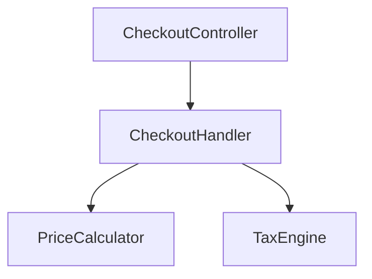

# Example: Audit an Inherited Legacy Codebase

## Prompt

```
/craftsman:legacy audit
I just inherited this Symfony app. No tests, no docs, and I need to add a
feature to checkout next week. Where do I even start?
```

## Expected Behavior

Claude confirms the basics, ranks hotspots, and produces a `LEGACY-AUDIT.md` telling you where to start, not everything that is wrong.

### 1. Confirm it runs

```
Before mapping, does it run and do the tests pass locally?
- Runs locally: [needed]
- Tests: [needed]
(If not, that is finding #1: get it running first.)
```

### 2. Consume an existing report if there is one

```
Do you already run SonarQube / CodeScene / PHPStan? If so:
  /craftsman:legacy audit --from sonar-report.json
I will use that as the complexity signal instead of recomputing a worse one.
```

### 3. Hotspots (churn x complexity)

```bash
python3 "${CLAUDE_PLUGIN_ROOT}/hooks/lib/hotspot_analysis.py" --since 12.month --top 15
```

```markdown
# Legacy Audit - shop-api

> Complexity source: built-in structural_metrics fallback (no external report provided)

## Hotspots (refactor top-right first)
| File | Complexity | Churn (12mo) | Quadrant | Risk |
|------|-----------|--------------|----------|------|
| Application/Checkout/CheckoutHandler.php | 631 | 48 | top-right | HIGH |
| Domain/Pricing/PriceCalculator.php | 402 | 39 | top-right | HIGH |
| Infrastructure/Legacy/TaxEngine.php | 812 | 3 | top-left | LOW |

## Dependency Map


## Where to Start
- First test: `CheckoutHandler.php` (hot, untested, on the path you must change)
- Why: highest churn x complexity, and it is exactly what your feature touches.

## Talking to Management
"Checkout changes take days and caused recent incidents; one file is the cause.
Two focused weeks drop that to hours per change, payback under three months."
```

### 4. Next step

```
Recommended path for your deadline:
  /craftsman:legacy cover     # net CheckoutHandler before you touch it
  then add your feature under the net.
For the full rescue, the `legacy-takeover` team or `legacy-surgeon` agent can drive it.
```

## Key Points

- The audit prioritizes; `TaxEngine` is scarier (812) but barely changes, so it waits.
- It consumes an existing tool report when available (`--from`), never competes with it.
- The output is a plan and a management case, not a wall of violations.
